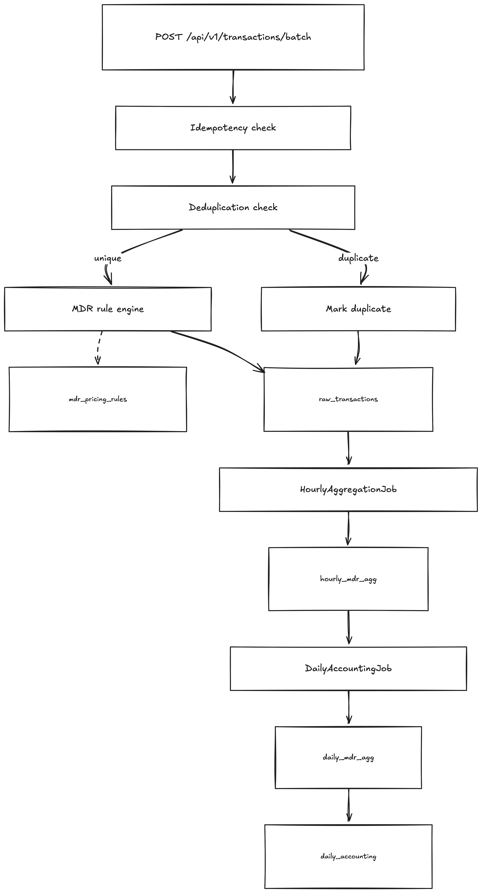

# MDR Pricing Engine

This project implements a rule-based MDR pricing pipeline for payment transactions using Java 17, Spring Boot 3, and MySQL.

The system accepts transaction batches, applies idempotency and deduplication checks, calculates MDR using configurable database rules, stores raw transaction facts, and rolls them up into hourly, daily, and accounting aggregates.

## Tech Stack

- Java 17
- Spring Boot 3.5.x
- Spring Web
- Spring Validation
- Spring Data JPA
- MySQL 8
- Docker / Docker Compose
- JUnit 5

## Problem Statement

The assignment models a payment-gateway MDR engine.

For each incoming payment transaction, the platform needs to:

1. accept the transaction batch safely
2. avoid double processing on retries
3. identify likely duplicates
4. select the correct MDR rule
5. calculate the MDR amount
6. preserve raw traceability
7. aggregate data for operational and accounting use

At scale, the assignment asks us to think about traffic moving from roughly `50 lakh` transactions per day toward `5 crore` transactions per day, so both correctness and operational scalability matter.




To start the repo, just docker compose up. 

## API

### Ingestion endpoint

```text
POST /api/v1/transactions/batch
```

### curl

From inside the app container:

```bash
docker compose exec -T app curl -sS -i \
  -H "Content-Type: application/json" \
  --data-binary @samples/batch-ingestion-sample.json \
  http://localhost:8080/api/v1/transactions/batch
```

From the host machine, if the server is running and port `8080` is exposed:

```bash
curl -sS -i \
  -H "Content-Type: application/json" \
  --data-binary @samples/batch-ingestion-sample.json \
  http://localhost:8080/api/v1/transactions/batch
```

### httpie

```bash
http POST :8080/api/v1/transactions/batch < samples/batch-ingestion-sample.json
```

### Expected success response

```json
{
  "totalReceived": 6,
  "duplicatesFound": 1,
  "successfullyPriced": 5,
  "batchId": "SAMPLE-BATCH-001",
  "message": "Batch processed successfully"
}
```

## Inspecting Stored Data

Check raw rows for the sample batch:

```bash
docker compose exec -T db mysql -u payu -ppayu payu -e "
SELECT
  txn_id,
  merchant_id,
  payment_mode,
  card_scheme,
  txn_amount,
  mdr_amount,
  rule_id,
  is_duplicate,
  trace_key
FROM raw_transactions
WHERE batch_id = 'SAMPLE-BATCH-001'
ORDER BY txn_id;
"
```

Useful cleanup command:

```bash
docker compose exec -T db mysql -u payu -ppayu payu -e "
DELETE FROM raw_transactions WHERE batch_id = 'SAMPLE-BATCH-001';
"
```

## Tests

Run the test suite inside the app container:

```bash
docker compose exec -T app mvn clean test
```


## Design Decisions

### 1. Aurora & MySQL Design

What I built:

The raw_transactions table uses a composite index on (merchant_id, txn_date) as the primary operational lookup pattern, and a separate index on dedup_key_hash for deduplication lookups. Idempotency is enforced using a UNIQUE KEY on txn_id plus a pre-insert lookup by txn_id; batch_id is also indexed for batch-level inspection and debugging. The schema is written as Aurora MySQL-compatible DDL.

What I would do at scale (50L -> 5Cr rows/day):

At 50L rows/day the current schema is sufficient. Moving to 5Cr rows/day (approximately 580 writes/second at peak) I would make three changes.

First, add date-based partitioning on raw_transactions using PARTITION BY RANGE (TO_DAYS(txn_date)). This lets the hourly aggregation job scan only the relevant date partition(s) rather than the full table, and MySQL can prune irrelevant partitions automatically.

Second, introduce a Kafka write-ahead layer. The API acknowledges into Kafka immediately (sub-millisecond), and a consumer fleet batches writes to Aurora. This decouples ingestion latency from DB write throughput entirely.

Third, implement tiered storage: raw rows older than 7 days are archived to S3 as Parquet and deleted from MySQL. At 5Cr rows/day, keeping 90 days of raw data in MySQL means 450Cr rows. Keeping only 7 days (35Cr rows) keeps the hot table manageable while cold data remains queryable via Athena for audits.

I would also switch the primary key from a random UUID string to a time-ordered ID such as ULID to reduce B-tree page splits during high-volume inserts, which is a common cause of write degradation in MySQL.


### 2. Pricing Mode

What I built:

Online pricing — MDR is calculated synchronously for each non-duplicate transaction before it is saved. Active rules are loaded from the database once per batch and reused across all transactions in that batch, which avoids per-transaction rule queries while keeping the database as the source of truth.

Why I chose this over offline pricing:

Offline pricing (save first, price later) creates a lag between ingestion and fee calculation. For an MDR engine, the priced transaction is the output of ingestion, so I chose to calculate mdr_amount before persisting the final raw row. This ensures that downstream systems reading raw_transactions see a fully priced transaction rather than an intermediate unpriced state.

What I would add at scale:

The current implementation reloads active rules once per batch and does not have a shared cross-batch cache. In production I would add an application-level cache with explicit invalidation on rule updates so that rule changes take effect quickly without requiring a restart. I would also add resilience around rule loading so that failures in the rules lookup path are isolated and observable.


### 3. Dedup Strategy
What I built:
On every ingestion, I compute a SHA-256 hash of merchant_id + DATE(txn_date) + payment_mode + txn_amount and store it as dedup_key_hash. During processing, I first check for duplicates already present in the current in-memory batch, and then query the database to see whether a non-duplicate row with the same hash exists with created_at within the dedup window. If yes, the transaction is flagged is_duplicate=true and mdr_amount=0. It is still saved to raw_transactions for auditability but excluded from aggregation jobs.

I deliberately excluded txn_id and order_id from the dedup key because those are system-generated identifiers and can differ across retries for the same underlying customer payment.

Pros of this approach:
No additional infrastructure. One indexed DB lookup per incoming transaction in the general case, plus an in-memory shortcut for duplicates within the same batch. Zero false positives in the current implementation. Every decision is auditable because dedup_key_hash and is_duplicate are stored on the row. The service is written to support a configurable dedup window via mdr.dedup.window-hours, with a default of 24 hours.

Cons of this approach:
At 50L transactions/day, the DB lookup still adds steady read load before insert. At 5Cr/day, that read amplification becomes a scalability bottleneck even with a dedicated index on dedup_key_hash.

What I would do at scale:
Replace the primary duplicate check with a Redis Bloom Filter. On ingestion, call BF.EXISTS on the dedup hash before falling back to the database. This removes most duplicate-check reads from MySQL while keeping the database as the source of truth. The Bloom Filter key would use a TTL aligned with the dedup window. The tradeoff is a small false-positive rate, so I would still retain the DB-backed path as a verification/fallback mechanism.


### 4. Data Drift & Rules
What I built:

The mdr_pricing_rules table stores effective_from, effective_to, and is_active on every rule. Only active rules are loaded from the database, and the rule engine checks date validity before scoring candidate rules, so expired rules are not applied. The rule_id selected for each transaction is stored on raw_transactions, which means every priced transaction can be traced back to the exact rule that produced its MDR amount.

What I would add in production:

Currently there is no automatic detection if the rule engine silently applies the wrong rule. In production I would add three detection layers:

Rule audit log table: 
Every change to mdr_pricing_rules would write an audit record with fields such as changed_by, changed_at, old_rate, and new_rate. If MDR amounts shift unexpectedly, the audit trail immediately shows whether a rule update caused it.

Daily reconciliation query: 
The daily job would compute the effective MDR rate actually applied per merchant/payment combination using SUM(mdr_amount) / SUM(txn_amount) and compare it against the expected rate from the rules table. Any variance above a threshold would be flagged for review.

Statistical drift alerting: 
Track the 7-day rolling average effective MDR rate per merchant/payment combination. If today’s effective rate deviates materially from that rolling baseline, raise an alert. This helps catch gradual drift that may not stand out in a single-day reconciliation.


### 5. Optional ML — Model Versioning and Rollback
What I built:
The current codebase does not implement the ML scoring service yet. As preparation for that extension, raw_transactions already includes risk_score and should_review columns, so model output can be stored alongside the raw transaction without affecting MDR calculation or downstream accounting.

What I would build next:
I would add a separate Python FastAPI service for transaction risk scoring. A simple first version could use an Isolation Forest model, which is a good fit here because it is unsupervised and does not require labeled fraud data. Candidate features would include txn_amount, hour of day, day of week, merchant transaction velocity, and amount-vs-merchant-average behavior. The service would expose a scoring endpoint, and the application would store the resulting risk_score and should_review values back on raw_transactions.

What I would add for production versioning:
In production I would version models as model_v{N}.pkl and control the active version through configuration, such as an ACTIVE_MODEL_VERSION environment variable. That would make rollback operationally simple and fast.

Why replaying 50L+ rows is usually unnecessary:
The ML output would be stored in separate columns such as risk_score and should_review, and it should remain completely separate from financial calculations. MDR amounts and accounting totals must continue to be driven only by the deterministic rule engine. That way, a bad model version affects review prioritization, not financial correctness, and rollback is primarily an operational workflow issue rather than a data-reprocessing issue.


### 6. Idempotency
What I built:
A two-level protection model.

At the primary level, idempotency is handled by txn_id. Before processing a batch, the service queries the database for any incoming txn_id values that already exist and skips those transactions before deduplication or pricing. In addition, txn_id also has a UNIQUE KEY constraint in the schema, which acts as a final database-level guard if duplicate requests race concurrently.

As a secondary safety net, the SHA-256 dedup hash catches cases where the same underlying transaction arrives with a different txn_id (for example, due to buggy retry logic). That transaction is saved as is_duplicate=true with mdr_amount=0 and excluded from downstream aggregation. In the current pipeline, the hourly aggregation query reads only is_duplicate=false rows, so duplicates never flow into hourly_mdr_agg, daily_mdr_agg, or daily_accounting.

What I would add at scale:
I would add a processed_batches table keyed by batch_id, storing a short-lived record of already-processed batches along with the original response payload. Before processing any transactions in a batch, the service could check whether that batch_id was already seen and, if so, return the cached response immediately without scanning the batch again. That would make repeated whole-batch retries cheaper and would provide a true batch-level idempotency layer on top of the current txn_id-based protection.


### 7. Error Handling
The API returns errors in a consistent JSON format:

```json
{
  "status": 400,
  "error": "Bad Request",
  "message": "Validation failed",
  "path": "/api/v1/transactions/batch",
  "fieldErrors": {
    "[0].txnId": "txnId is required"
  }
}
```

Fields:

- `status`: HTTP status code
- `error`: HTTP reason phrase
- `message`: safe, human-readable error message
- `path`: request path
- `fieldErrors`: field-level validation errors for bad requests; empty for non-validation errors

Supported error scenarios:

| Scenario | HTTP code | Response message |
| --- | --- | --- |
| Missing required field (`txnId`, `merchantId`, `txnAmount`, etc.) | 400 Bad Request | `Validation failed` + field-level details |
| `txnAmount` is zero or negative | 400 Bad Request | `Validation failed` + `txnAmount must be positive` |
| Malformed JSON request body | 400 Bad Request | `Malformed JSON request` |
| Unknown route / missing endpoint | 404 Not Found | `Resource not found` |
| Unexpected server-side failure (for example DB/runtime exception) | 500 Internal Server Error | `Internal server error` |

Notes:

- Validation errors include field-level details, including indexed batch items such as `"[0].txnId": "txnId is required"`.
- Internal exception details such as stack traces or SQL errors are not returned in the API response.
- The current implementation does not return `404` when no MDR rule matches. In that case, the transaction is still processed with `mdr_amount = 0.00` and `rule_id = null`, and the rule engine logs a warning.

### 8. Docker
The entire system starts with a single command:
`docker compose up`

This starts two containers in dependency order: mysql:8 starts first, and the Spring Boot application waits for the MySQL healthcheck to pass before starting, using depends_on with condition: service_healthy.

On first boot, MySQL automatically runs sql/schema.sql and sql/seed_data.sql from the docker-entrypoint-initdb.d mount. This creates the schema tables and inserts the baseline MDR pricing rules. No manual setup is required.

### 9. Testing
The test suite covers unit tests for core logic and one integration test for the end-to-end ingestion flow.

MdrRuleEngineTest (6 tests):    
Tests the rule scoring and MDR calculation logic in isolation using Mockito. It covers:

- merchant-specific rule winning over a generic rule
- generic rule applying when no merchant-specific rule exists
- fallback to the catch-all default rule
- expired rules not being selected
- zero rules returning an MDR amount of 0.00
- MDR amount precision and rounding (1.85% of 1234.56 -> 22.84)

DeduplicationServiceTest (7 tests):     
Tests dedup hash generation and duplicate detection in isolation. It covers:

- unique transaction not flagged
- same hash within the 24-hour window flagged as duplicate
- same hash outside the window not flagged
- different amounts producing different hashes
- different merchants producing different hashes
- deterministic hashing for identical inputs
- SHA-256 hash length always being 64 hex characters

BatchIngestionIntegrationTest (3 tests):    
Loads the full Spring Boot context and exercises the batch ingestion API against the configured MySQL-backed application context. It covers:
- a batch of 3 transactions where 1 is a deliberate duplicate, verifying is_duplicate=true on the duplicate, correct mdr_amount on unique transactions, and rule_id populated
- re-sending the same transaction batch, verifying exactly 1 row exists in the database for that txn_id
- empty batch handling, verifying the API returns 201 Created with zero counts instead of failing
